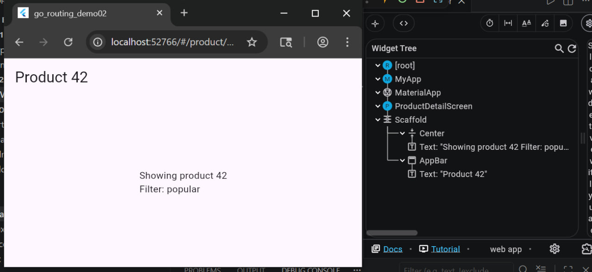
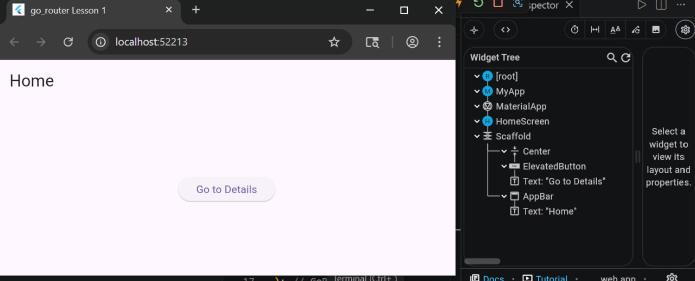
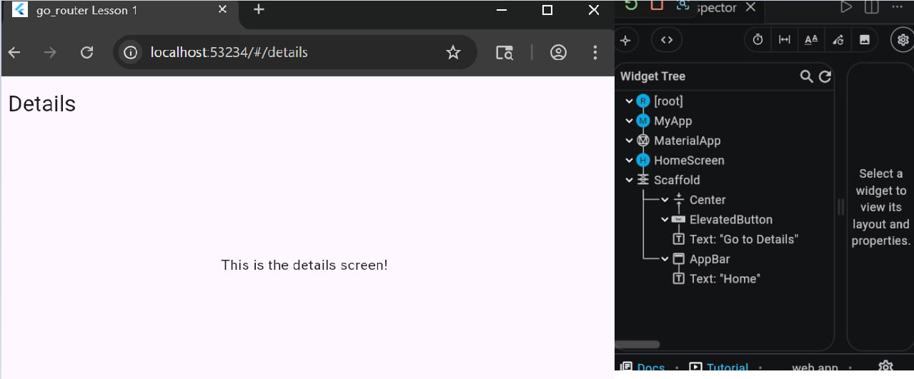
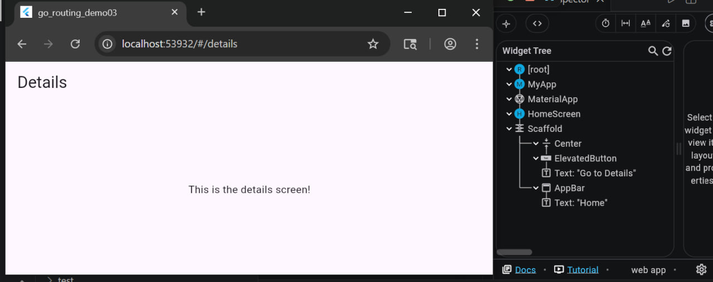
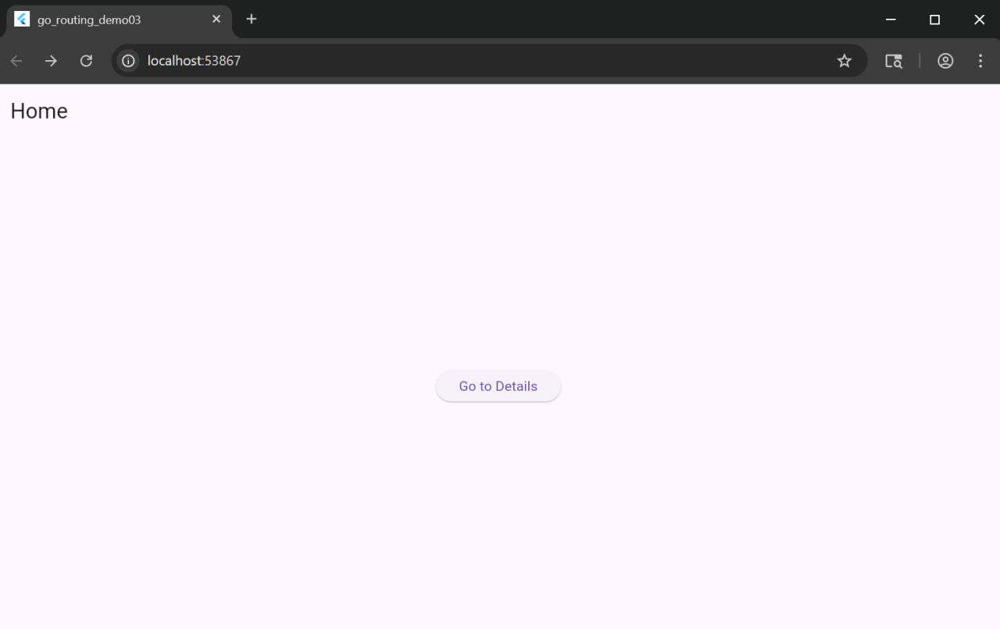
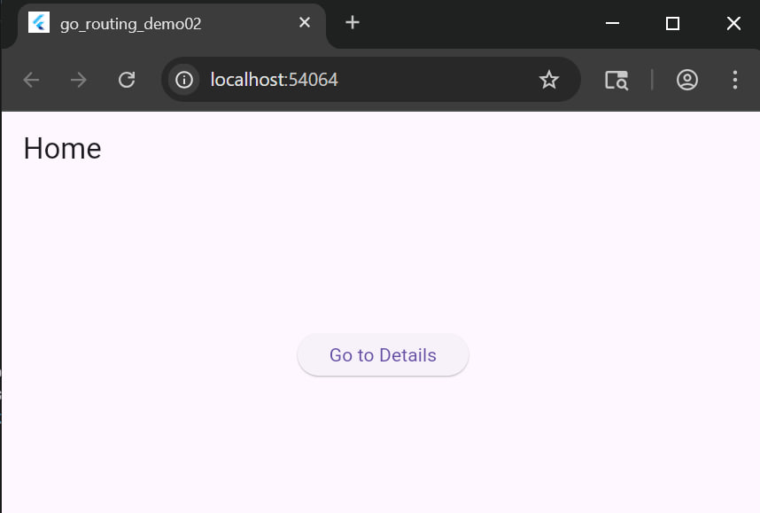
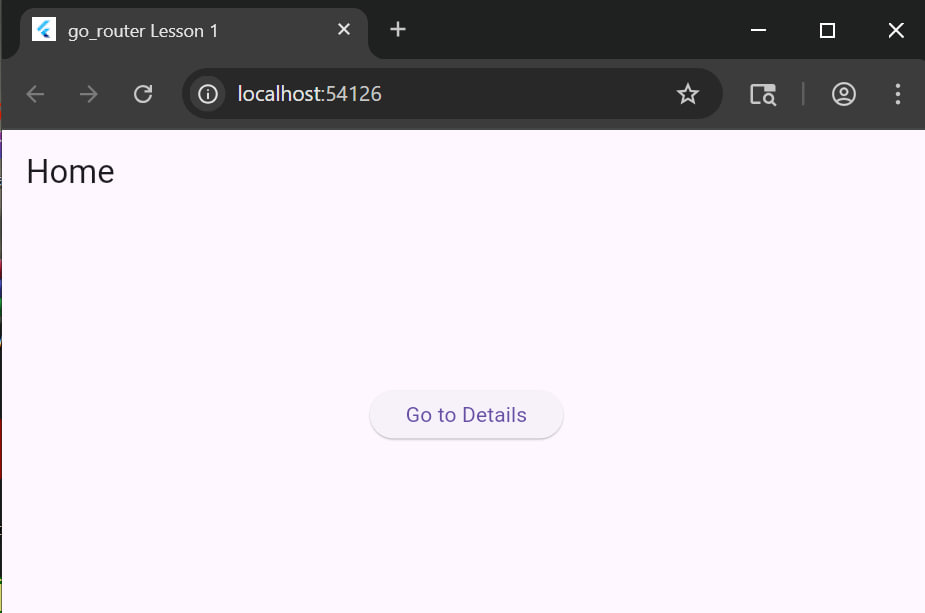

# Flutter Navigator 2.0

This repository contains a collection of Flutter projects demonstrating various aspects of navigation using Flutter's Navigator 2.0 (Router API).

## Project Structure

The repository is organized as follows:
- `go_routing_demo01/`: First demonstration project for Go Router navigation.
- `go_routing_demo02/`: Second demonstration project for Go Router navigation.
- `go_routing_demo03/`: Third demonstration project for Go Router navigation.
- `Screenhshots/`: Screenshots and images related to the projects.

## Included Flutter Projects

1. **go_routing_demo01**: Basic implementation of Go Router for navigation.
2. **go_routing_demo02**: Advanced routing features with Go Router.
3. **go_routing_demo03**: Complex navigation scenarios using Navigator 2.0.
4. **(Additional project if present)**: Further demonstrations.

## Screenshots

Here are some screenshots from the projects:

## Personal Information

Done by Nathnael Tefera  
ID No - UGR/9296/16  
Section 1